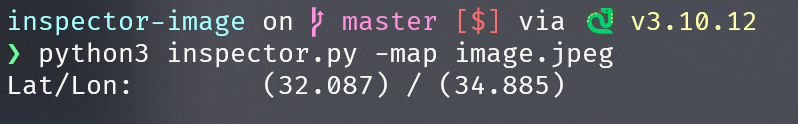
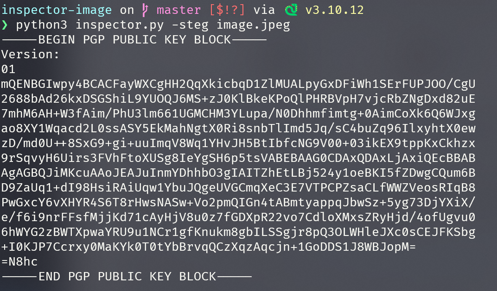

# Stenography Tool

## Task
The main purpose of this project is to find:
- location where photo was taken;
- hidden message in image.


## Functionality

>extract_gps_info(image_path):
    This function extracts GPS coordinates from the EXIF data of an image file. It reads the EXIF tags to find latitude and longitude values and then converts these values from degrees, minutes, and seconds to decimal degrees. 

>convert_to_degrees(value):
    This helper function converts a GPS coordinate value from degrees, minutes, and seconds format to decimal degrees format. It takes an EXIF tag value as input and calculates the decimal degrees by dividing the numerator by the denominator for each part (degrees, minutes, seconds) and summing them appropriately.

>check_image_validity(image_path):
    This function checks if the given image file is valid. It tries to open and verify the image using the PIL library. If the image is invalid or corrupt, it catches the exception and returns False; otherwise, it returns True.

>read_and_convert_to_ascii(file_path):
    This function reads the binary content of a file, converts it to hexadecimal, and then decodes it to an ASCII string. It filters out non-printable characters and only includes those in the range of 32 to 126 (printable ASCII characters).

>extract_pgp_key(ascii_string):
    This function searches an ASCII string for a PGP public key block. It uses a regular expression to find the key block wrapped between -----BEGIN PGP PUBLIC KEY BLOCK----- and -----END PGP PUBLIC KEY BLOCK-----. If found, it returns the PGP key; otherwise, it returns None.

>print_pgp_key(file_path):
    This function reads a file, converts its content to ASCII, and attempts to extract and print the PGP public key block. It formats the key block for better readability and prints it. If no key block is found, it prints a message indicating that.

>main():
    This is the main function that handles command-line arguments and coordinates the functionality. It uses argparse to parse the -map and -steg flags for processing location extraction and PGP key extraction, respectively. Based on the arguments provided, it validates the image file and performs the appropriate action (extracting GPS info or printing the PGP key).
- Check the Repo content
- Files that must be inside your repository:
    - Your program source code.
    - a README.md file, Which clearly explains how to use the program.
- Are the required files present?
- Ask the student to run his program with the first argument -map, and the second argument the image.jpeg file. You can find that at this path: ../resources/image.jpeg
Compare the result to that of an online exif metadata viewer, does the result correspond to 32 Latitude, and 34 Longitude?



- Ask the student to execute his program again, with the argument -steg instead of -map.



Was a PGP key displayed with the following format?
```
-----BEGIN PGP PUBLIC KEY BLOCK-----
[pgp key]
-----END PGP PUBLIC KEY BLOCK-----
```
## How to run
### Step 1: Install Python

1. **Download Python**: Go to the [official Python website](https://www.python.org/downloads/) and download the latest version of Python for your operating system.
2. **Install Python**: Run the downloaded installer. Make sure to check the option "Add Python to PATH" during installation.

### Step 2: Install Required Libraries

Once Python is installed, you can use `pip` (Python's package installer) to install the necessary libraries.

1. **Open a Command Prompt or Terminal**.
2. **Install `argparse`, `Pillow`, and `exifread`**:

    ```sh
    pip install argparse pillow exifread
    ```
### Step 3: Run The Project
When everythjing is installed you can run project using:
```sh
python3 inspector.py -map image.jpeg
python3 inspector.py -steg image.jpeg
```
## Author
[Viktoriia/vavstanc](https://01.kood.tech/git/vavstanc)